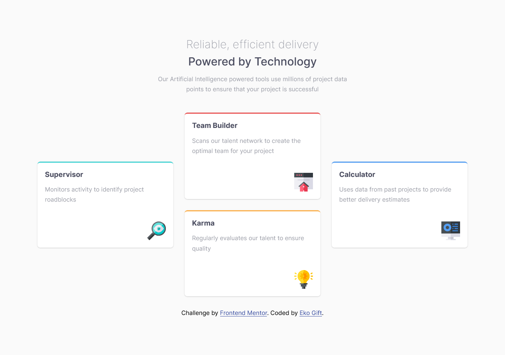

# Frontend Mentor - Four card feature section solution

This is a solution to the [Four card feature section challenge on Frontend Mentor](https://www.frontendmentor.io/challenges/four-card-feature-section-weK1eFYK). Frontend Mentor challenges help you improve your coding skills by building realistic projects.

## Table of contents

- [Overview](#overview)
  - [The challenge](#the-challenge)
  - [Screenshot](#screenshot)
  - [Links](#links)
- [My process](#my-process)
  - [Built with](#built-with)
  - [What I learned](#what-i-learned)
- [Author](#author)

## Overview

### The challenge

Users should be able to:

- View the optimal layout for the site depending on their device's screen size

### Screenshot

### Links

- Solution URL: [(https://github.com/Eko-U/nft_card](https://github.com/Eko-U/four-card-features)
- Live Site URL: [https://eko-u.github.io/nft_card/](https://eko-u.github.io/four-card-features/)

### Built with

- Semantic HTML5 markup
- CSS custom properties
- Flexbox
- CSS Grid

### What I learned
I have been able to reinforce my knowledge on Flexbox, CSS Grid, and creating a responsive design using media queries.

## Author

- Frontend Mentor - [@Eko-U](https://www.frontendmentor.io/profile/Eko-U)
- Twitter - [@eko_gift](https://www.twitter.com/eko_gift)